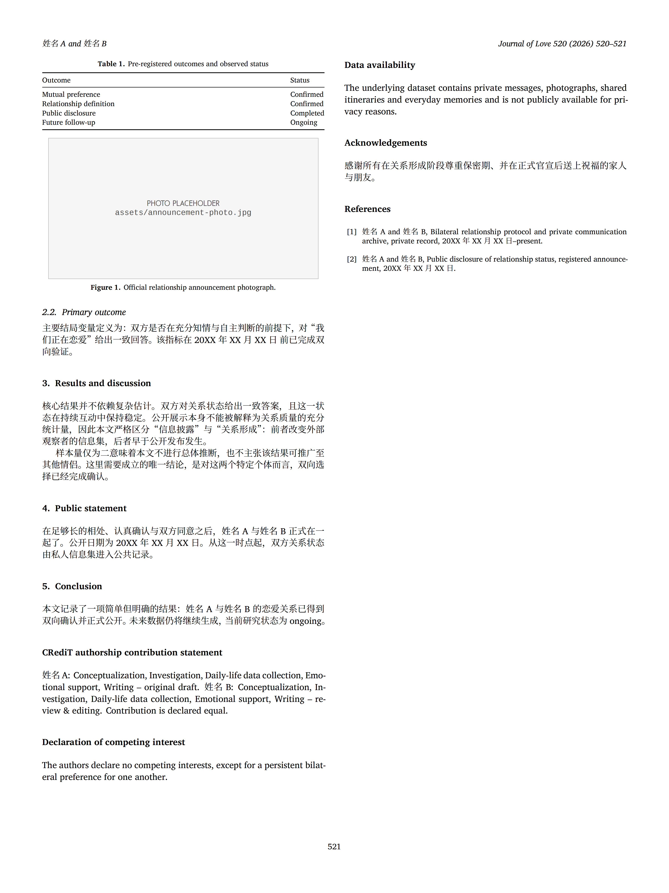
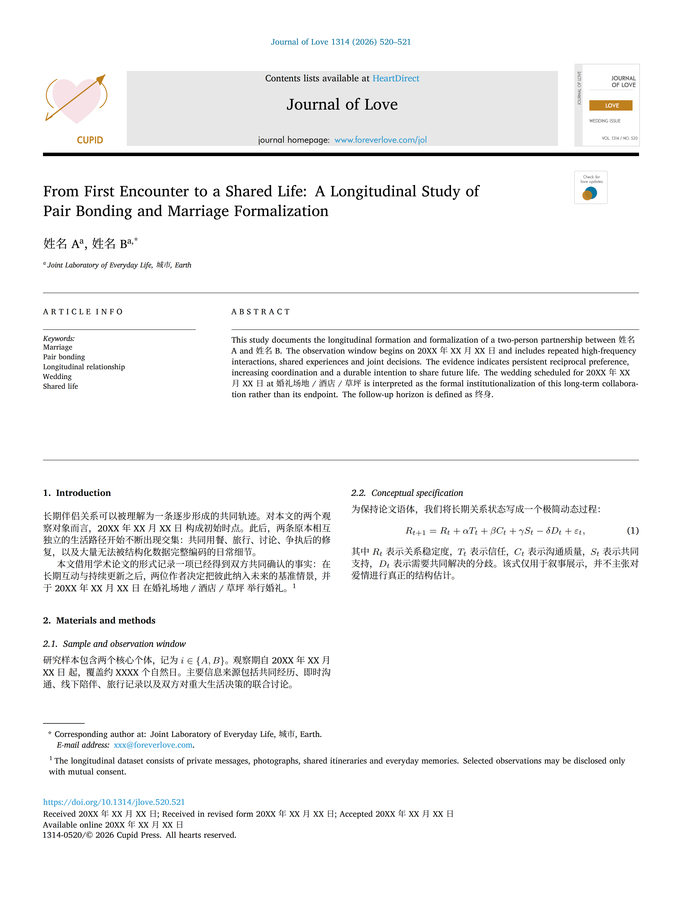
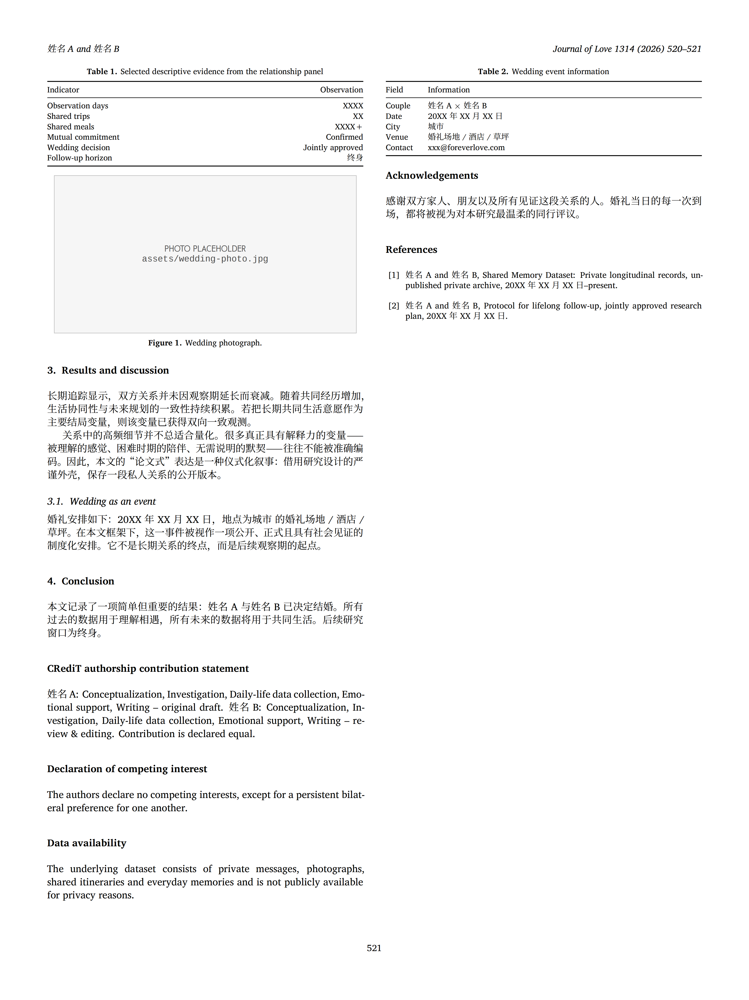

# Journal of Love · 婚礼学报 LaTeX 模板


把一段私人关系，排版成一篇 SCI 期刊论文。 / *Typeset your love story as a journal article.*

用 LaTeX 把一场婚礼或一次官宣排成 Elsevier 期刊论文的样子：刊头、卷期页码、ARTICLE INFO 与 ABSTRACT 分栏、通讯作者脚注、DOI、投稿和接收日期，角落里还有一枚手绘的 Cupid 出版社标志。

A LaTeX template that sets a wedding invitation or a relationship announcement as an Elsevier-style journal article: masthead, volume and issue, the split ARTICLE INFO and ABSTRACT panel, corresponding-author footnote, DOI, submission dates, and a hand-drawn Cupid publisher mark.

[中文文档](#中文文档) · [English Documentation](#english-documentation)

---

## 中文文档

### 这是什么

这是一个可以直接改的 LaTeX 模板，把两个人之间的故事写成一篇结构完整的研究论文。

- `love_announcement.tex` 用于恋爱官宣，`wedding_journal.tex` 用于婚礼学报或请柬。
- 两份模板共用 `couple-info.tex` 里的数据，改一处就同步更新。
- 版式照真实期刊页面复刻：210 × 280 mm 页面、双栏正文、页眉页脚、三线表、小号图注，位置都用绝对坐标（bp）确定。
- 正文的中西文分别交给 `fontspec` 和 `xeCJK`。
- 照片可选。把图片放进 `assets/` 就行；没有图片时模板画一个灰色占位框，编译照常通过。

#### 关于 520 和 1314

期刊元数据里埋了数字梗：520 谐音“我爱你”，1314 谐音“一生一世”。所以婚礼版的卷号是 1314、期号是 520，页码从 520 开始，DOI 写成 `10.1314/jlove.520.521`，版权行是 *All hearts reserved*。这些都能改，见「自定义」。

### 效果预览

恋爱官宣版 `love_announcement.tex`：

| 第 1 页（期刊首页） | 第 2 页（正文与参考文献） |
| :---: | :---: |
| [](preview/love-announcement-p1.png) | [](preview/love-announcement-p2.png) |

婚礼学报版 `wedding_journal.tex`：

| 第 1 页（期刊首页） | 第 2 页（正文与参考文献） |
| :---: | :---: |
| [](preview/wedding-journal-p1.png) | [](preview/wedding-journal-p2.png) |

点击任意图片可以看 300 dpi 原图（3571 × 4762）。第 2 页 Figure 1 里的灰框就是没放照片时的占位框，把照片放进 `assets/` 就会换成真图。

### 文件结构

```text
Journal-of-Wedding-Latex-Template/
├── couple-info.tex          # ★ 唯一需要修改的文件
├── love_announcement.tex    # 恋爱官宣版
├── wedding_journal.tex      # 婚礼学报版
├── journaloflove-sci.sty    # 版式与样式（仿 SCI 首页 + 双栏正文）
├── preview/                 # README 预览图（各 2 页，300 dpi）
│   ├── love-announcement-p1.png
│   ├── love-announcement-p2.png
│   ├── wedding-journal-p1.png
│   └── wedding-journal-p2.png
└── assets/                  # 照片目录（仓库未包含，需要自己新建）
    ├── announcement-photo.jpg
    └── wedding-photo.jpg
```

### 环境要求

| 项目 | 要求 |
| --- | --- |
| TeX 发行版 | TeX Live 或 MacTeX，建议装完整版（需要 `xeCJK`、`titlesec` 等）。实测 TeX Live 2025 |
| 编译引擎 | XeLaTeX，不能用 pdfLaTeX 或 LuaLaTeX |
| 编译次数 | 至少 2 次。首页用 `remember picture` 绝对定位，第二遍才定得下来 |
| 宏包 | `fontspec`、`xeCJK`、`geometry`、`xcolor`、`tikz`、`graphicx`、`multicol`、`amsmath`、`amssymb`、`mathtools`、`booktabs`、`tabularx`、`array`、`caption`、`fancyhdr`、`titlesec`、`hyperref`、`microtype`、`enumitem`、`etoolbox`、`ragged2e`（以及文档类 `extarticle`） |

### 字体

`journaloflove-sci.sty` 开头指定了 6 种字体。少一种，XeLaTeX 就会直接报错停下：

```
! Package fontspec Error: The font "Charis SIL" cannot be found.
```

| 字体 | 用途 | 来源 | 授权 | TeX Live 自带 |
| --- | --- | --- | --- | --- |
| Charis SIL | 正文西文 / 数学外文 | [software.sil.org/charis](https://software.sil.org/charis/) | SIL OFL 1.1 | 是（TTF 在 `fonts/truetype/SIL/charissil/`） |
| Universalis ADF Std | 无衬线（标志、页眉小字） | [CTAN: universalis](https://ctan.org/pkg/universalis) | GPL v2+（含字体例外） | 是 |
| Liberation Mono | 等宽（占位框里的路径文字） | [liberationfonts](https://github.com/liberationfonts/liberation-fonts) | SIL OFL 1.1 | 否 |
| Noto Serif CJK SC | 中文正文 | [notofonts/noto-cjk](https://github.com/notofonts/noto-cjk) | SIL OFL 1.1 | 否 |
| Noto Sans CJK SC | 中文无衬线 | 同上 | SIL OFL 1.1 | 否 |
| Noto Sans Mono CJK SC | 中文等宽 | 同上 | SIL OFL 1.1 | 否 |

安装方式是下载后装进系统：macOS 用「字体册」，Windows 右键选“为所有用户安装”，Linux 放进 `~/.local/share/fonts/` 再跑一次 `fc-cache -f`。

不想装字体的话，用下面的片段替换 `journaloflove-sci.sty` 第 40 到 46 行，也就是从 `\defaultfontfeatures{Ligatures=TeX}` 到 `\setCJKmonofont` 这 7 行。模板会自己挑本机有的字体。这段片段在 TeX Live 2025 上试过，两份文档各 2 页，没有报错：

```latex
% ---- 字体自动回退：缺字体时也不会编译失败 ----
\defaultfontfeatures{Ligatures=TeX}

\IfFontExistsTF{Charis SIL}
  {\setmainfont{Charis SIL}}
  % TeX Live 自带 CharisSIL 的 TTF，可以直接按文件名调用
  {\setmainfont{CharisSIL-Regular.ttf}[
     BoldFont=CharisSIL-Bold.ttf,
     ItalicFont=CharisSIL-Italic.ttf,
     BoldItalicFont=CharisSIL-BoldItalic.ttf]}

\IfFontExistsTF{Universalis ADF Std}
  {\setsansfont{Universalis ADF Std}}
  {\setsansfont{Hiragino Sans GB}}
\IfFontExistsTF{Liberation Mono}
  {\setmonofont{Liberation Mono}}
  {\setmonofont{Menlo}}

\IfFontExistsTF{Noto Serif CJK SC}
  {\setCJKmainfont[AutoFakeBold=2.3,AutoFakeSlant=.16]{Noto Serif CJK SC}}
  {\setCJKmainfont[AutoFakeBold=2.3,AutoFakeSlant=.16]{Songti SC}}
\IfFontExistsTF{Noto Sans CJK SC}
  {\setCJKsansfont{Noto Sans CJK SC}}
  {\setCJKsansfont{PingFang SC}}
\IfFontExistsTF{Noto Sans Mono CJK SC}
  {\setCJKmonofont{Noto Sans Mono CJK SC}}
  {\setCJKmonofont{Menlo}}
```

在别的系统上用，把回退字体换成本机常见的字体：

| 平台 | 中文正文回退 | 中文无衬线回退 | 等宽回退 |
| --- | --- | --- | --- |
| macOS | `Songti SC` | `PingFang SC` | `Menlo` |
| Windows | `SimSun` | `Microsoft YaHei` | `Consolas` |
| Linux | `Noto Serif CJK SC` / `Source Han Serif SC` | `Noto Sans CJK SC` | `Noto Sans Mono` |

> 想验证某个字体名能不能用，可以编一个最小文档，看日志里有没有 `not loadable`。
> 想把版式原样还原，装齐上表这六种字体最省事。

### 编译

```bash
# 恋爱官宣版
xelatex love_announcement.tex
xelatex love_announcement.tex     # 再跑一遍，首页绝对定位与超链接才准确

# 婚礼学报版
xelatex wedding_journal.tex
xelatex wedding_journal.tex
```

也可以交给 `latexmk`：

```bash
latexmk -xelatex -interaction=nonstopmode wedding_journal.tex
```

输出 `wedding_journal.pdf` 和 `love_announcement.pdf`，各 2 页。第 1 页是期刊首页，第 2 页是正文续页和参考文献。

### 自定义

#### 1. 只改 `couple-info.tex`

| 变量 | 含义 | 官宣版 | 婚礼版 |
| --- | :--- | :---: | :---: |
| `\PartnerA`、`\PartnerB` | 两位主角的名字 | 是 | 是 |
| `\FirstMeetingDate` | 初次相遇 / 观察起点 | 是 | 是 |
| `\RelationshipDate` | 确认关系日期 | 是 | 是 |
| `\AnnouncementDate` | 公开（官宣）日期 | 是 | 否 |
| `\WeddingDate` | 婚礼日期 | 否 | 是 |
| `\WeddingCity`、`\WeddingVenue` | 城市与场地 | 否 | 是 |
| `\ContactEmail` | 通讯邮箱 | 是 | 是 |
| `\DaysObserved`、`\SharedTrips`、`\SharedMeals` | 观察天数 / 共同旅行 / 共同用餐（正文与描述统计表用） | 否 | 是 |
| `\FutureHorizon` | 随访期（默认「终身」） | 是 | 是 |
| `\OurMotto` | 备用签名句，目前两份模板都没有引用，可以自己插到正文里 | 否 | 否 |

#### 2. 改标题、摘要、期刊信息

标题、摘要和期刊信息都在两个 `.tex` 文件顶部的 `\setJOL...` 命令里：

| 命令 | 作用 |
| --- | --- |
| `\setJOLTitle` | 论文标题（大字号，建议不超过 2 行） |
| `\setJOLAuthors` | 作者行，`\textsuperscript{a}`、`\textsuperscript{a,*}` 是单位与通讯标记 |
| `\setJOLAffilA` / `\setJOLAffilB` | 单位（`B` 为空则不显示） |
| `\setJOLKeywords` | 关键词，用 `\\` 换行 |
| `\setJOLAbstract` | 摘要（建议控制在 200 词以内，太长会溢出首页固定区域） |
| `\setJOLCoverSub` / `\setJOLCoverIssue` | 右上角迷你封面上的栏目标签与卷期 |
| `\setJOLMeta` | 顶部刊名行（同时会更新右侧页眉） |
| `\setRunningAuthor` | 页眉左侧的作者名 |
| `\setJOLCorrespondence`、`\setJOLEmail` | 通讯作者信息与邮箱 |
| `\setJOLDOI`、`\setJOLReceived`、`\setJOLOnline`、`\setJOLCopyright` | 页脚 DOI、日期戳与版权行 |
| `\setJOLFootnoteText` | 首页脚注（编号 ¹ 的那段） |

#### 3. 正文里的排版工具

| 命令 / 环境 | 说明 |
| --- | --- |
| `\begin{JOLtable}{标题} … \end{JOLtable}` | 期刊风格小号三线表（内部用 `tabularx`，表宽 = 栏宽） |
| `\JOLphoto{路径}{图注}` | 插图；文件不存在时自动画灰色占位框并显示路径 |
| `\JOLsource{来源}` | 图下小字 Source 注 |
| `\makeJOLfrontmatter` | 生成首页整套刊头版面，放在 `\begin{document}` 之后第一行 |

#### 4. 放照片

新建 `assets/` 目录，按下面的文件名放照片。用别的名字也可以，改 `\JOLphoto` 的路径参数就行：

- 官宣版：`assets/announcement-photo.jpg`
- 婚礼版：`assets/wedding-photo.jpg`

### 常见问题

1. `! Package fontspec Error: The font "Charis SIL" cannot be found.`
   字体没装。见上面「字体」一节，或者直接套用自动回退片段。
2. 页眉和首页元素错位，标题与摘要重叠
   首页刊头照参考期刊页面用绝对坐标（bp）画出来，每块区域高度固定。标题超过 2 行、摘要太长、作者行太长都会挤出边界。把文案改短，或者微调 `journaloflove-sci.sty` 里 `\JOLPutText` 的坐标参数：前两个数字是从页面左上角算起的横向和纵向偏移，单位 bp。
3. 中文显示成方框或空白
   中文字体没装，见「字体」一节。
4. 超链接和定位不对
   只编译了一次。XeLaTeX 要跑两遍。
5. 页码不从 1 开始
   模板故意从 520 开始。改 `\setcounter{page}{520}` 就行。
6. 图片和表格跑到意料之外的位置
   它们是 `[t]` 浮动体，会排在栏顶，期刊排版本来就是这样。
7. 想在 Overleaf 上用
   上传整个项目，把编译器设成 XeLaTeX。如果报字体缺失，套用上面的自动回退片段。

### 许可证与声明

- 仓库还没有声明许可证，使用前先和作者确认。建议补一个：代码用 MIT，文档用 CC BY 4.0。
- 字体各自遵循原有授权。Charis SIL、Liberation、Noto CJK 是 SIL OFL 1.1，Universalis ADF Std 是 GPL v2+（含字体例外）。分发嵌入了字体的 PDF 时请遵守相应条款。
- 版式是对学术期刊页面样式的模仿，只用于私人纪念，不要拿去冒充真实出版物或做商业出版。

### 致谢

感谢所有见证这段关系的人。如果这个模板帮你写完了属于自己的那篇“论文”，欢迎点个 Star。

---

## English Documentation

### What is this

A LaTeX template that writes the story of two people as a full research article.

- `love_announcement.tex` is the relationship announcement; `wedding_journal.tex` is the wedding issue or invitation.
- Both share the data in `couple-info.tex`, so one edit updates both documents.
- The layout follows a real journal page: 210 × 280 mm, two-column body, running head and foot, three-line tables, small figure captions, all positioned at absolute coordinates (bp).
- `fontspec` handles the Latin text, `xeCJK` the Chinese.
- Photos are optional. Put images in `assets/`; where an image is missing, the template draws a grey placeholder and the build still succeeds.

#### About 520 and 1314

The journal metadata carries a pun. In Chinese, 520 sounds like "I love you" and 1314 like "forever", so the wedding issue is volume 1314, number 520, with the first page numbered 520, a DOI of `10.1314/jlove.520.521`, and a copyright line reading *All hearts reserved*. All of it is editable, see Customization.

### Preview

Relationship announcement, `love_announcement.tex`:

| Page 1 (journal front page) | Page 2 (body and references) |
| :---: | :---: |
| [](preview/love-announcement-p1.png) | [](preview/love-announcement-p2.png) |

Wedding issue, `wedding_journal.tex`:

| Page 1 (journal front page) | Page 2 (body and references) |
| :---: | :---: |
| [](preview/wedding-journal-p1.png) | [](preview/wedding-journal-p2.png) |

Click any image for the 300 dpi original (3571 × 4762). The grey box in Figure 1 on page 2 is the placeholder drawn when no photo is present; a file in `assets/` replaces it.

### Repository layout

```text
Journal-of-Wedding-Latex-Template/
├── couple-info.tex          # ★ the only file you need to edit
├── love_announcement.tex    # relationship-announcement issue
├── wedding_journal.tex      # wedding issue
├── journaloflove-sci.sty    # layout & styling (journal front page + two-column body)
├── preview/                 # README preview images (2 pages each, 300 dpi)
│   ├── love-announcement-p1.png
│   ├── love-announcement-p2.png
│   ├── wedding-journal-p1.png
│   └── wedding-journal-p2.png
└── assets/                  # photo folder (not in the repo — create it yourself)
    ├── announcement-photo.jpg
    └── wedding-photo.jpg
```

### Requirements

| Item | Requirement |
| --- | --- |
| TeX distribution | TeX Live or MacTeX, full install recommended (the template needs `xeCJK`, `titlesec` and others). Tested on TeX Live 2025 |
| Engine | XeLaTeX. pdfLaTeX and LuaLaTeX will not work |
| Passes | At least 2. The front page is positioned with `remember picture`, which settles on the second pass |
| Packages | `fontspec`, `xeCJK`, `geometry`, `xcolor`, `tikz`, `graphicx`, `multicol`, `amsmath`, `amssymb`, `mathtools`, `booktabs`, `tabularx`, `array`, `caption`, `fancyhdr`, `titlesec`, `hyperref`, `microtype`, `enumitem`, `etoolbox`, `ragged2e`, plus the `extarticle` class |

### Fonts

`journaloflove-sci.sty` asks for 6 fonts. Miss one and XeLaTeX stops with an error:

```
! Package fontspec Error: The font "Charis SIL" cannot be found.
```

| Font | Used for | Source | License | Ships with TeX Live |
| --- | --- | --- | --- | --- |
| Charis SIL | Latin body text & math | [software.sil.org/charis](https://software.sil.org/charis/) | SIL OFL 1.1 | yes (`fonts/truetype/SIL/charissil/`) |
| Universalis ADF Std | Sans (logo, headers, small print) | [CTAN: universalis](https://ctan.org/pkg/universalis) | GPL v2+ with font exception | yes |
| Liberation Mono | Monospace (placeholder path text) | [liberationfonts](https://github.com/liberationfonts/liberation-fonts) | SIL OFL 1.1 | no |
| Noto Serif CJK SC | CJK body text | [notofonts/noto-cjk](https://github.com/notofonts/noto-cjk) | SIL OFL 1.1 | no |
| Noto Sans CJK SC | CJK sans | same | SIL OFL 1.1 | no |
| Noto Sans Mono CJK SC | CJK monospace | same | SIL OFL 1.1 | no |

Installing means adding them to the OS: Font Book on macOS, right-click and choose "Install for all users" on Windows, or `~/.local/share/fonts/` plus `fc-cache -f` on Linux.

If you would rather not install anything, replace lines 40 to 46 of `journaloflove-sci.sty`, the 7 lines from `\defaultfontfeatures{Ligatures=TeX}` through `\setCJKmonofont`, with the snippet below. It picks whichever font the machine actually has. The snippet was tested on TeX Live 2025: both documents compile, 2 pages each, no errors.

```latex
% ---- Automatic font fallback: never fails on a missing font ----
\defaultfontfeatures{Ligatures=TeX}

\IfFontExistsTF{Charis SIL}
  {\setmainfont{Charis SIL}}
  % TeX Live bundles CharisSIL TTFs, addressable by file name
  {\setmainfont{CharisSIL-Regular.ttf}[
     BoldFont=CharisSIL-Bold.ttf,
     ItalicFont=CharisSIL-Italic.ttf,
     BoldItalicFont=CharisSIL-BoldItalic.ttf]}

\IfFontExistsTF{Universalis ADF Std}
  {\setsansfont{Universalis ADF Std}}
  {\setsansfont{Hiragino Sans GB}}
\IfFontExistsTF{Liberation Mono}
  {\setmonofont{Liberation Mono}}
  {\setmonofont{Menlo}}

\IfFontExistsTF{Noto Serif CJK SC}
  {\setCJKmainfont[AutoFakeBold=2.3,AutoFakeSlant=.16]{Noto Serif CJK SC}}
  {\setCJKmainfont[AutoFakeBold=2.3,AutoFakeSlant=.16]{Songti SC}}
\IfFontExistsTF{Noto Sans CJK SC}
  {\setCJKsansfont{Noto Sans CJK SC}}
  {\setCJKsansfont{PingFang SC}}
\IfFontExistsTF{Noto Sans Mono CJK SC}
  {\setCJKmonofont{Noto Sans Mono CJK SC}}
  {\setCJKmonofont{Menlo}}
```

On other platforms, swap the fallbacks for that platform's usual faces:

| Platform | CJK serif fallback | CJK sans fallback | Mono fallback |
| --- | --- | --- | --- |
| macOS | `Songti SC` | `PingFang SC` | `Menlo` |
| Windows | `SimSun` | `Microsoft YaHei` | `Consolas` |
| Linux | `Noto Serif CJK SC` / `Source Han Serif SC` | `Noto Sans CJK SC` | `Noto Sans Mono` |

> To check whether a font name resolves, compile a minimal document and look for `not loadable` in the log.
> Installing all six fonts above is still the simplest way to reproduce the layout exactly.

### Building

```bash
# relationship announcement
xelatex love_announcement.tex
xelatex love_announcement.tex     # run twice: front-page anchors and links need it

# wedding issue
xelatex wedding_journal.tex
xelatex wedding_journal.tex
```

Or let `latexmk` do it:

```bash
latexmk -xelatex -interaction=nonstopmode wedding_journal.tex
```

Output: `wedding_journal.pdf` and `love_announcement.pdf`, 2 pages each. Page 1 is the journal front page; page 2 continues the body and carries the reference list.

### Customization

#### 1. Edit only `couple-info.tex`

| Variable | Meaning | Announcement | Wedding |
| --- | :--- | :---: | :---: |
| `\PartnerA`, `\PartnerB` | The two authors | yes | yes |
| `\FirstMeetingDate` | First encounter / start of observation | yes | yes |
| `\RelationshipDate` | Relationship confirmed | yes | yes |
| `\AnnouncementDate` | Public disclosure date | yes | no |
| `\WeddingDate` | Wedding date | no | yes |
| `\WeddingCity`, `\WeddingVenue` | City and venue | no | yes |
| `\ContactEmail` | Corresponding e-mail | yes | yes |
| `\DaysObserved`, `\SharedTrips`, `\SharedMeals` | Days observed / trips / meals (used in the descriptive table) | no | yes |
| `\FutureHorizon` | Follow-up horizon (default “终身” = lifelong) | yes | yes |
| `\OurMotto` | A reserved motto that neither template uses; insert it yourself if you want it | no | no |

#### 2. Titles, abstract and journal metadata

The `\setJOL...` commands at the top of `love_announcement.tex` and `wedding_journal.tex` hold the metadata:

| Command | Effect |
| --- | --- |
| `\setJOLTitle` | Article title (keep it to 2 lines) |
| `\setJOLAuthors` | Author line; `\textsuperscript{a}` / `\textsuperscript{a,*}` mark affiliation and corresponding author |
| `\setJOLAffilA` / `\setJOLAffilB` | Affiliations (`B` is hidden when empty) |
| `\setJOLKeywords` | Keywords, separated by `\\` |
| `\setJOLAbstract` | Abstract (keep it under ~200 words; longer text overflows the fixed front-page band) |
| `\setJOLCoverSub` / `\setJOLCoverIssue` | Section label and volume/issue on the miniature cover |
| `\setJOLMeta` | Top-of-page metadata line; also updates the running head |
| `\setRunningAuthor` | Author name in the running head |
| `\setJOLCorrespondence`, `\setJOLEmail` | Corresponding-author block |
| `\setJOLDOI`, `\setJOLReceived`, `\setJOLOnline`, `\setJOLCopyright` | Footer DOI, date stamps, copyright line |
| `\setJOLFootnoteText` | The footnote marked ¹ on the front page |

#### 3. Typesetting helpers

| Command / environment | Purpose |
| --- | --- |
| `\begin{JOLtable}{caption} … \end{JOLtable}` | Journal-style compact three-line table (`tabularx`, column width) |
| `\JOLphoto{path}{caption}` | Figure; a grey placeholder with the path is drawn if the file is missing |
| `\JOLsource{source}` | Small "Source." note under a figure |
| `\makeJOLfrontmatter` | Renders the whole front page; place it right after `\begin{document}` |

#### 4. Adding photos

Create `assets/` and drop the photos in under these names. Other names work if you change the path in `\JOLphoto`:

- Announcement: `assets/announcement-photo.jpg`
- Wedding: `assets/wedding-photo.jpg`

### FAQ

1. `! Package fontspec Error: The font "Charis SIL" cannot be found.`
   A font is missing. See [Fonts](#fonts), or apply the fallback snippet.
2. Front-page elements are misaligned or overlapping
   The masthead is drawn at absolute coordinates (bp) in bands of fixed height. A title longer than 2 lines, an overlong abstract or a long author line will spill past its band. Shorten the text, or adjust the coordinates passed to `\JOLPutText` in `journaloflove-sci.sty`: the first two numbers are the horizontal and vertical offsets in bp from the top-left corner of the page.
3. Chinese text shows up as boxes or goes missing
   The CJK fonts are not installed. See [Fonts](#fonts).
4. Links or positions are wrong
   You compiled once. XeLaTeX needs two passes.
5. The page number does not start at 1
   That is deliberate, it starts at 520. Change `\setcounter{page}{520}`.
6. Figures or tables land somewhere unexpected
   They are `[t]` floats pinned to the top of a column, which is how journal pages work; `JOLtable` and `\JOLphoto` set `[t]` themselves.
7. Using Overleaf
   Upload the project and set the compiler to XeLaTeX. If a font error appears, apply the fallback snippet above.

### License & notices

- No license is declared yet. Check with the author before reusing this. Adding one is worth doing: MIT for the code, CC BY 4.0 for the docs.
- The fonts keep their own licenses. Charis SIL, Liberation and Noto CJK are SIL OFL 1.1; Universalis ADF Std is GPL v2+ with a font exception. Respect those terms when you distribute a PDF with embedded fonts.
- The layout imitates the look of an academic journal page. Use it for private keepsakes, not to pass as a real publication or to publish commercially.

### Acknowledgements

Thanks to everyone who witnessed this relationship. If this template helped you finish a paper of your own, a star is welcome.

---

*Journal of Love, Cupid Press. All hearts reserved.*
